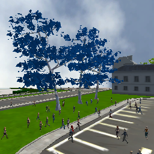
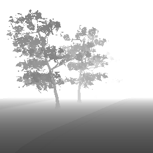
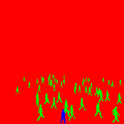
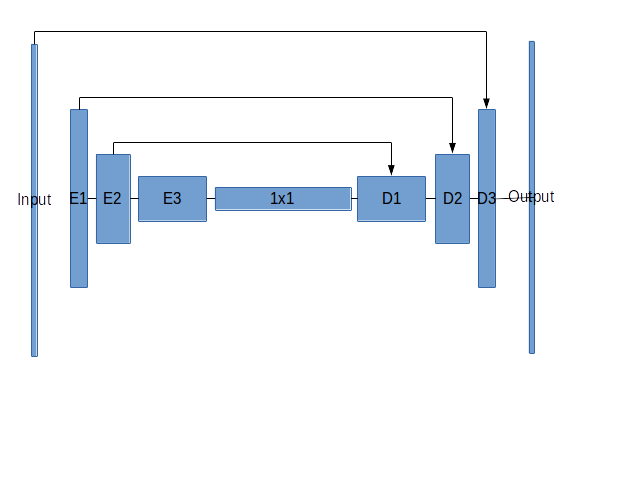
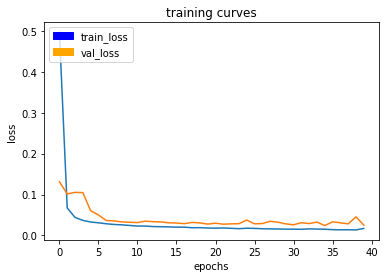
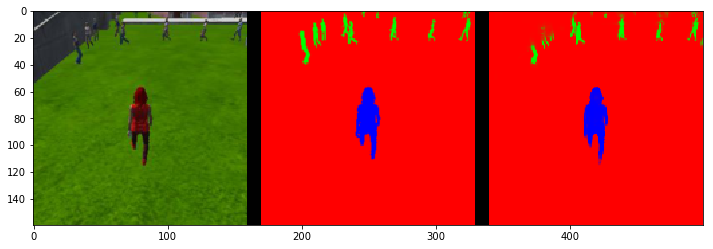
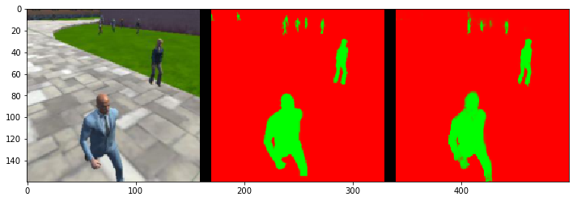
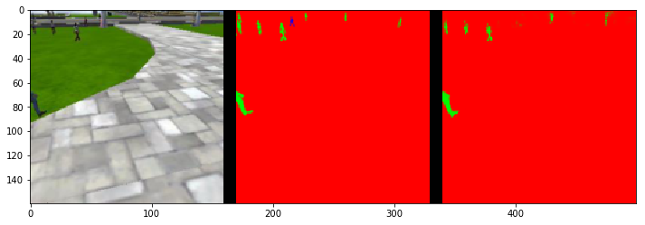

## Project: Deep Learning Follow Me

Udacity has provided a simulator of a drone in a crowded city, and requested that that drone to identify and follow the one dressed in red without continuous input from the user.  In other words, we need to train a convolutional neural network to solve the problem of semantic segmentation for the scene.  Thankfully, in the past few sections Udacity has introduced the concepts and tools necessary to perform this take, namely TensorFlow.

### Data Gathering

Udacity provided a sample training data set from the scene.  These images were captured from the cameras on the drone in the simulator.  To create the training data, the simulation has solved the problem as the hero is the only thing visible in camera3, the crowd is filtered in camera2, and the background is in camera4.  preprocess_ims.py takes the three images and combines them into 1, the mask image.  This defines the ground truth pixel by pixel for the model to train against.  In the mask image, blue is our target (camera3), green are is the crowd (camera2), and red is the background (camera4).

  

### Provided Scaffolding

There was a lot provided with this project to digest.  First the ultimate tool that is training the model is TensorFlow.  This is the open source framework for data processing, one of the most popular uses being training deep learning models.  Keras is built on top of TensorFlow to make some of the common features of TensorFlow easier to use.  Udacity further abstracts these operations with the scaffolding provided in the notebook.  Basically we were given the pieces, and we had to put those pieces together to separate hero and crowd from picture.

### Network Architecture

Since goal of this project is semantic segmentation, I created a Fully Convolutional Network as discussed in the lesson with skip layer connections.

The encoder layers are 2d separable convolution layers with RELU activation, and then batch normalized.  These layers discern features of an image with increasing complexity.  For example, the first layer might recognize simple lines, the second shapes, and the the objects.  Because we're doing semantic segmentation, there are multiple things that need to be classified within the image, so we need to retain spacial information of our features.  The 1x1 convolution layer allows that magic to happen in a much more computationally efficient way than with fully connected layers.  If our goal was to classify the picture, we could stop there, but it's not.  Our goal is to classify every pixel of the picture, so we add decoder blocks.  The decoder blocks upsample using bilinear upsampling.  This is a method that expands data using the weighted average of the value and distance of the nearest 4 pixels.  By utilizing skip connection in the decoder, the network is able to take the coarse upsampled data and make better determinations about the new pixels.  Without skip connections the result is not nearly as smooth.  The final layer is a softmax classifier for the pixel.

### Tuning

I trained the network on AWS instead of my local laptop and this drastically cut down on train time of the network!  Who knew?

Some definitions:

batch_size = how many training images must be analyzed before an update to the weights  
num_epochs = the number of trips through the entire training data set  
steps_per_epoch = how many batches per epoch  
validation_steps =steps_per_epoch for the validation set

<!-- From the stackoverflow answers I could find, steps_per_epoch * batch_size = data set size.  There seems to be quite a fine balance between these parameters, the performance, and how long it takes to run.  batch_size seemed to have the biggest impact on performance in terms of time to train.  I found that once the batch_size was around 100, it really started to take a lot longer to train.   -->

I wound up a batch_size at 80 (up from 40), steps_per_epoch at 104, validation_steps at 30, and 40 epochs.

learning_rate is how big of steps the updates to the weight are allowed to take after a batch.  This is the one parameter that seems to have a default rule, that is "if all else fails, lower the learning rate".  My model with the best performance had a learning rate at 0.002.

### Model Results

The metric of evaluation is the Intersection over union.  That is the number of correctly identified pixels divided by the number of total pixels.  The final score for this model was 0.42.

Here is the drone following the hero, IOU for hero is 0.907:  
  

Here is the drone not seeing a hero, IOU for the crowd is 0.728:  
  

Here is the performance with hero + crowd at distance, IOU hero is 0.223 and 0.43 for crowd:    
  

It was really cool watching the drone follow the hero with the model.  I'd like to see how that flows into the controls, but I didn't know where to look.

### Improvement

<!-- There's obviously a lot of room to improve the model, seeing as how I didn't achieve a passing IOU.  It does however seem to work in the simulator though.

Once I got the project setup, I chose to attempt to get the passing score using the setup instead of messing with the configuration.  That is, training my model without signing up for and installing CUDA, switching to my Windows partition with more free storage, or signing up for and training my model on AWS.  Either of those things would let me more systematically test hyper-parameters, or use a wider range of hyper-parameters with less frustration.  I did have trouble getting data into AWS, is it just a matter of command line downloading and installing the data?  Or is there some drag and drop trick I could have used? -->

I think first and foremost, feeding the model more data when the drone is not following the hero, and the drone is at range.  I successfully gathered that data, and it is pictured in the first section.  How much data should go into retraining?  I could not find any clear direction for how much data on-line.  How do you setup the hyper parameters to add new training data to ensure you don't break the model that was already trained?

There are also instances in the evaluation data, where the hero is missing legs, or the segment isn't as clear as it should be.  I think that is the kind of thing that could be fixed with another layer which probably means more training.

The only classes that are in this data are hero, and people.  If I would want to train with other object, like dogs for instance, that would need to be in the training data.  This model would not work with that.
